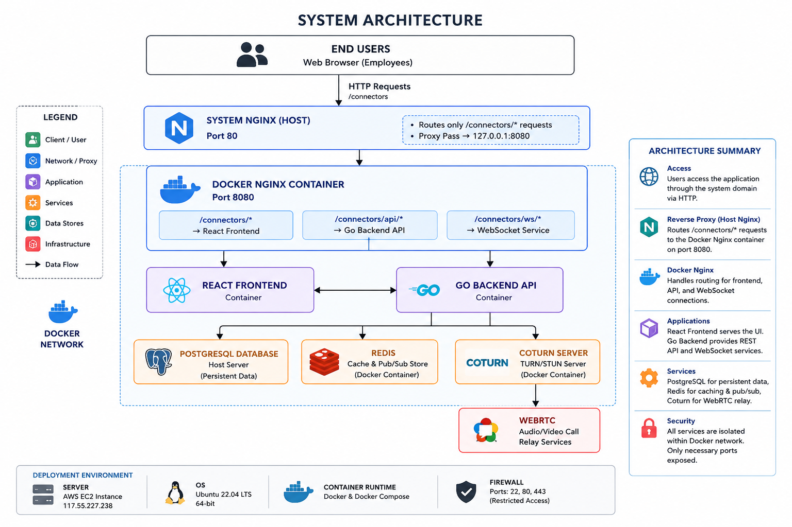

<div align="center">
  
  <h1>OrgChat</h1>
  <p><strong>A secure, full-featured internal messaging and calling platform for IT organizations.</strong></p>

  <p>
    
    
    
    
    
    
  </p>
</div>

---

## 📖 Table of Contents

- [Overview](#-overview)
- [✨ Features](#-features)
- [🏗️ Architecture & Tech Stack](#️-architecture--tech-stack)
- [📁 Project Structure](#-project-structure)
- [🚀 Quick Start (Docker)](#-quick-start-docker)
- [💻 Local Development](#-local-development)
- [📡 API & Real-time Systems](#-api--real-time-systems)
- [🔒 Environment Variables](#-environment-variables)

---

## 🔭 Overview

OrgChat is an enterprise-grade internal communication platform designed for IT organizations. It unifies real-time text chat, file sharing, and high-quality audio/video calls into a single cohesive application.

The platform is designed to be highly secure, supporting optional **End-to-End Encryption (E2EE)** for direct messages, robust administrative controls, and secure AWS S3 / Local Disk file handling. It includes a built-in Selective Forwarding Unit (SFU) written in Go for highly scalable WebRTC group calls and screen sharing.

---

## ✨ Features

- **Real-Time Messaging**: Instant WebSocket-based messaging, typing indicators, read receipts, and threaded replies.
- **Advanced Chat Capabilities**: Scheduled messages, message pinning, rich link previews, custom reactions, and inline polls.
- **Audio & Video Calls**: Built-in Go WebRTC SFU (via Pion) supporting group video calls, screen sharing, waiting rooms, and in-call signaling (e.g., raise hand).
- **Productivity Tools**: Shared whiteboards with drafting/publishing, task management, and personal reminders.
- **Google Calendar Integration**: Sync Google Calendar events, schedule meetings, and generate instant join links.
- **Robust Security**: JWT-based authentication with refresh tokens, rate limiting, and an opt-in E2EE mode using public-key cryptography.
- **Admin Console**: User management, system-wide broadcasts, audit logs, call history, and platform statistics.

---

## 🏗️ Architecture & Tech Stack


### Backend
- **Core Framework**: Go (Golang) using the [Gin](https://gin-gonic.com/) web framework.
- **Database Layer**: PostgreSQL accessed via [GORM](https://gorm.io/).
- **Real-Time Communication**: [Gorilla WebSocket](https://github.com/gorilla/websocket) for persistent socket connections.
- **WebRTC SFU**: [Pion](https://github.com/pion/webrtc) for native Selective Forwarding Unit capabilities.
- **Caching & Pub/Sub**: Redis for session management, rate limiting, and pub/sub.
- **Storage**: AWS S3 integration via `aws-sdk-go-v2` (with fallback to local storage).

### Frontend
- **Framework**: React 18 combined with Vite 5 for lightning-fast builds.
- **State Management**: [Zustand](https://github.com/pmndrs/zustand) for global state and [React Query](https://tanstack.com/query) for server-state caching.
- **Styling**: TailwindCSS 3 for rapid, responsive, and beautiful UI development.
- **Routing**: React Router v6.

### DevOps & Infrastructure
- **Orchestration**: Docker & Docker Compose.
- **Proxy**: NGINX acting as a reverse proxy for the frontend SPA and backend API/WebSocket.
- **TURN/STUN**: Integration with `coturn` for WebRTC NAT traversal.

---

## 📁 Project Structure

```text
orgchat/
├── backend-go/             # Go backend application
│   ├── config/             # Environment configuration
│   ├── database/           # PostgreSQL connection & migrations
│   ├── handlers/           # HTTP controllers for REST API
│   ├── middleware/         # Auth, Rate Limiting, Security headers
│   ├── models/             # GORM definitions
│   ├── services/           # Business logic (Auth, Users, Messages, Calls)
│   ├── sfu/                # Pion WebRTC SFU implementation
│   ├── store/              # Redis store implementation
│   ├── websocket/          # WebSocket connection manager
│   └── main.go             # Entry point
│
├── frontend/               # React application
│   ├── src/                # Components, Pages, Context, Hooks, Utils
│   ├── vite.config.js      # Vite build configuration
│   └── tailwind.config.js  # Styling variables
│
├── coturn/                 # TURN/STUN server configuration
├── nginx/                  # NGINX configuration files
└── docker-compose.yml      # Orchestration definition
```

---

## 🚀 Quick Start (Docker)

To run the complete stack quickly using Docker Compose:

1. **Clone the repository:**
   ```bash
   git clone https://github.com/orgchat/connectors.git
   cd connectors
   ```

2. **Configure Environments:**
   Copy the example environment files for the backend and frontend:
   ```bash
   cp backend-go/.env.example backend-go/.env
   cp frontend/.env.example frontend/.env
   ```
   > **Note:** Because Docker Compose runs PostgreSQL on your host network implicitly, ensure `DATABASE_URL` in `backend-go/.env` resolves correctly (e.g., `host.docker.internal` instead of `localhost`).

3. **Start the containers:**
   ```bash
   docker-compose up --build -d
   ```

4. **Access the application:**
   - Web Application: `http://localhost:8080`
   - Backend API: `http://localhost:50000` (UDP port for WebRTC is mapped, API is internal or proxied depending on NGINX).

---

## 💻 Local Development

### 1. PostgreSQL & Redis
Ensure you have a PostgreSQL server and a Redis server running locally.

### 2. Backend (Go)
```bash
cd backend-go

# Download Go modules
go mod download

# Set your .env variables, including DATABASE_URL and REDIS_URL
# Example: DATABASE_URL="host=localhost user=postgres password=secret dbname=orgchat port=5432 sslmode=disable"

# Run the backend application
go run main.go
```
The backend will run on port `8000`.

### 3. Frontend (React)
```bash
cd frontend

# Install Node dependencies
npm install

# Start the Vite development server
npm run dev
```
The frontend will start on `http://localhost:5173`. Ensure your `.env` contains the correct `VITE_BACKEND_URL` (e.g., `http://localhost:8000`).

---

## 📡 API & Real-time Systems

### RESTful API
The backend exposes a comprehensive RESTful API protected by JWT tokens. Key routes include:
- `/api/auth/*` - Login, registration, token refresh.
- `/api/users/*` - Directory listing, profile management.
- `/api/conversations/*` - Create, list, manage DMs and groups.
- `/api/messages/*` - Send, edit, delete, react, schedule.
- `/api/calls/*` - Initiate, join, invite to WebRTC rooms.
- `/api/admin/*` - Platform management endpoints.
- `/api/google/calendar/*` - Google Calendar OAuth integration.

### WebSocket Events
A single persistent WebSocket connection (`/ws/connect`) manages real-time features.
- **Server to Client**: `message:new`, `message:typing`, `user:online`, `call:incoming`, `webrtc:offer`, `webrtc:ice`, `call:roster`
- **Client to Server**: `call:initiate`, `call:answer`, `call:ice`, `message:typing`

---

## 🔒 Environment Variables

### Backend (`backend-go/.env`)
- `DATABASE_URL`: PostgreSQL connection string.
- `REDIS_URL`: Redis connection URL (e.g., `redis://localhost:6379`).
- `SECRET_KEY`: JWT Signing Key.
- `COMPANY_EMAIL_DOMAIN`: Restrict sign-ups to a specific domain.
- `UPLOADS_DIR`: Directory for file attachments.
- `TURN_SERVER_URL` / `TURN_USERNAME` / `TURN_CREDENTIAL`: WebRTC relay details.

### Frontend (`frontend/.env`)
- `VITE_BACKEND_URL`: URL of the Go backend (e.g., `http://localhost:8000/api`).
- `VITE_BACKEND_WS_URL`: WebSocket URL (e.g., `ws://localhost:8000/ws`).
